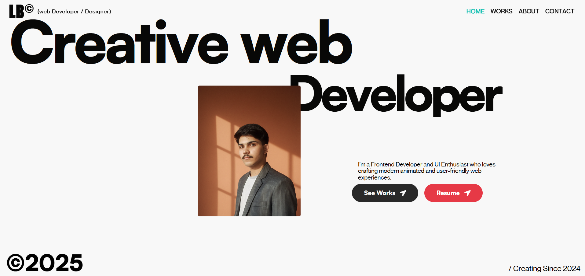
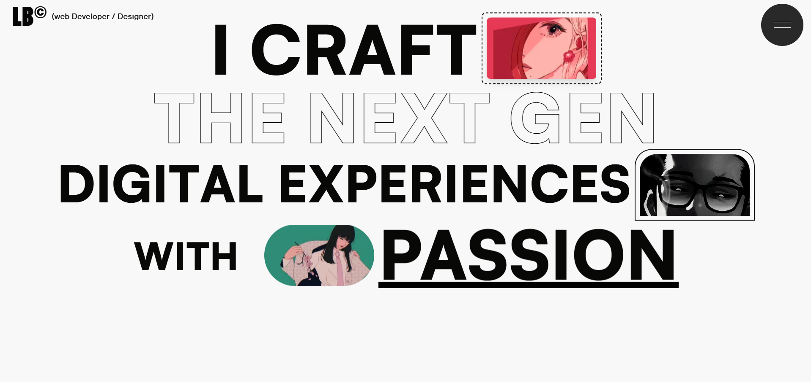
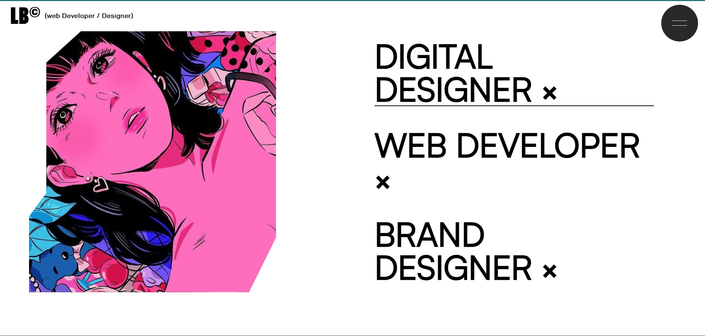
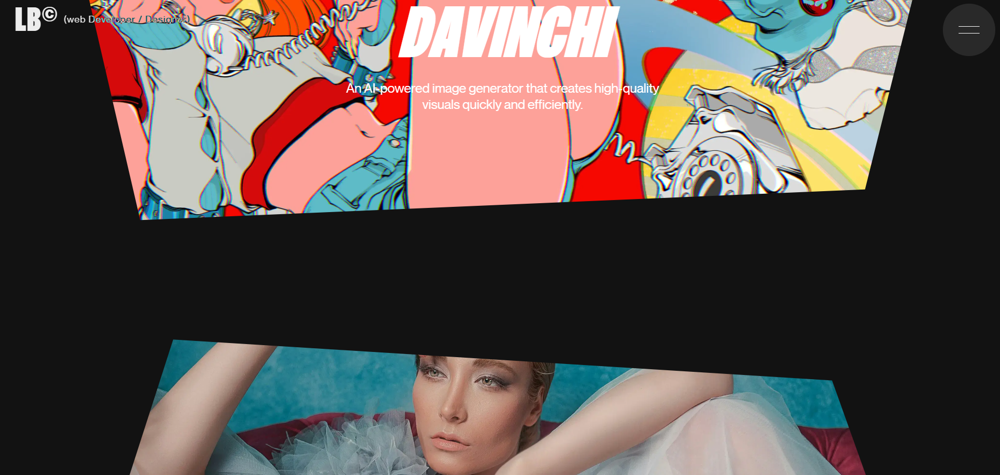
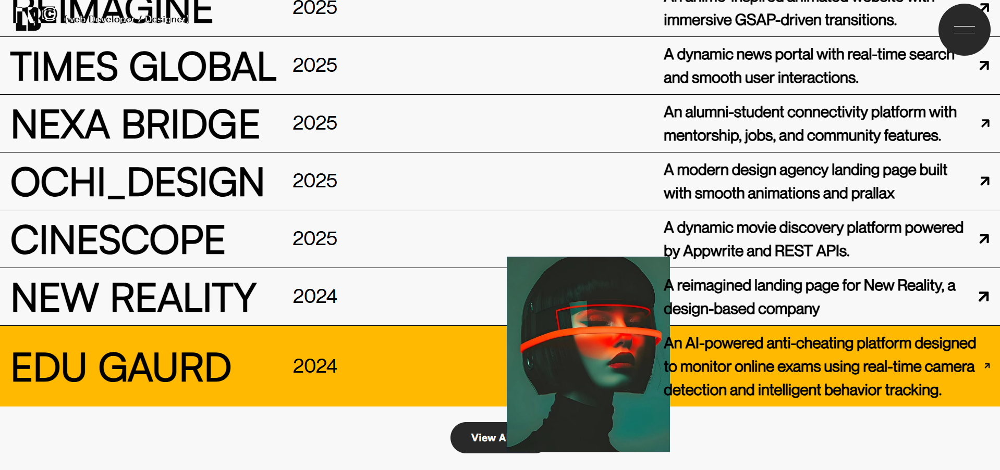
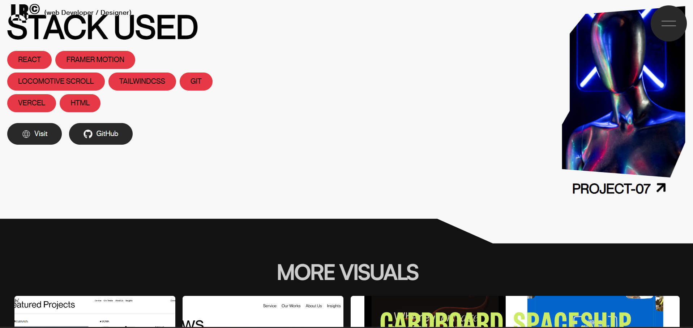
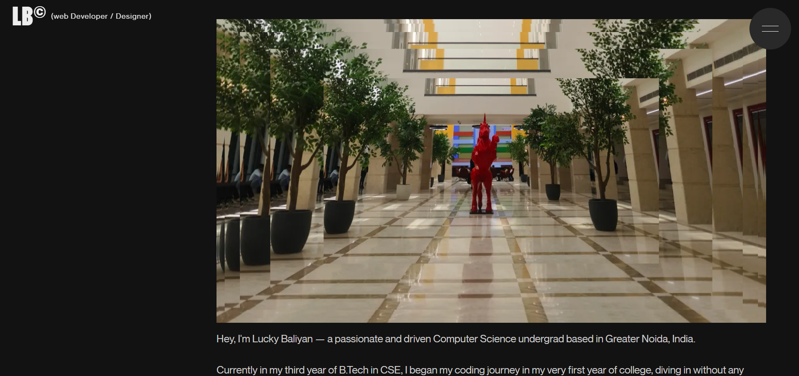
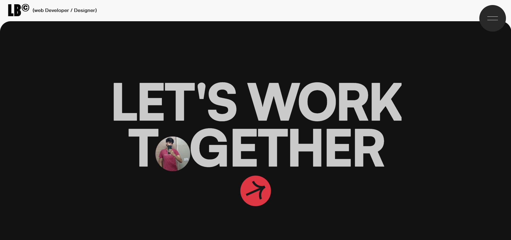
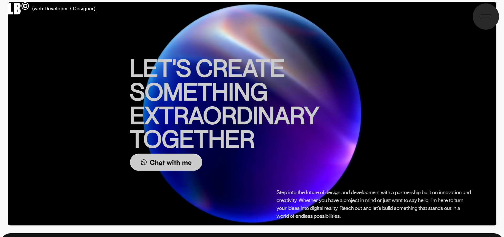

# 🌐 LB_Portfolio — Creative Developer Portfolio

A **modern, motion-driven portfolio** built using **React**, **TailwindCSS**, **GSAP**, and **Lenis**, designed to deliver a smooth, interactive, and visually immersive user experience.

This project represents a fusion of **design aesthetics** and **engineering precision**, showcasing creativity through animations, transitions, and storytelling.

---

## 🧠 About This Portfolio

The **LB Portfolio** is a creative web experience built to represent the modern developer’s identity through motion, smooth flow, and clean design.

It combines:
- ⚛️ **React** — for a dynamic component-based structure  
- 🎨 **TailwindCSS** — for scalable, minimal, and responsive styling  
- 🎞️ **GSAP (GreenSock Animation Platform)** — for cinematic motion and page transitions  
- 🌀 **Lenis** — for buttery-smooth, inertia-based scroll behavior  

Every animation, hover, and reveal has been crafted to feel deliberate and fluid — turning this portfolio into a **living showcase of creativity and code**.

## Screen Shots

## Landing Page

## Latest Projects

## All Projects

## Single Project Page

## About

## Footer

## Contacts

---

## ✨ Features

- **Smooth scrolling** powered by Lenis  
- **Dynamic page transitions** using GSAP  
- **Split-text animations** for headings and text reveals  
- **Reusable component structure** (buttons, cards, features, etc.)  
- **Optimized layout design** with `MainLayout.jsx`  
- **Section-based architecture** for scalability and modularity  

---

## 🧩 Folder Structure

LB_Portfolio/    
├── public/  
│ └── videos/  
├── src/  
│ ├── animations/  
│ │ ├── cards/  
│ │ ├── pageTransition/  
│ │ ├── Reavel/  
│ │ └── splitText/  
│ ├── components/  
│ │ ├── buttons/  
│ │ ├── cards/  
│ │ ├── features/  
│ │ ├── footer/  
│ │ ├── header/  
│ │ └── sections/  
│ ├── context/  
│ │ └── data.js  
│ ├── hooks/  
│ │ └── lenis/  
│ │ └── useLenis.js  
│ ├── layouts/  
│ │ └── MainLayout.jsx  
│ ├── pages/  
│ │ ├── About.jsx  
│ │ ├── Contact.jsx  
│ │ ├── Home.jsx  
│ │ ├── Project.jsx  
│ │ └── Works.jsx  
│ ├── App.jsx  
│ ├── Global.css  
│ └── main.jsx  
└── package.json 

---

## 🛠️ Tech Stack

| Category | Technology |
|-----------|-------------|
| **Frontend Framework** | React.js |
| **Styling** | TailwindCSS |
| **Animation Library** | GSAP (GreenSock) |
| **Smooth Scroll** | Lenis |
| **Layout Handling** | Custom React Layout Components |
| **Routing** | React Router |
| **Build Tool** | Vite |
| **Version Control** | Git & GitHub |

---

## 💡 Design Philosophy

> **“Where design meets motion.”**  
> **“A portfolio built to move.”**  
> **“Crafted with React. Animated with GSAP. Styled in motion.”**

This portfolio was designed to **feel alive** — every scroll, transition, and animation adds to the storytelling.  
It’s not just a collection of pages; it’s a **continuous experience** powered by clean code and expressive motion.

---

🚀 Future Improvements

Add dark/light mode toggle
Improve SEO optimization with meta tags and Open Graph
Add Pre-loading Techniques to render large videos and images

---

🧾 Copyright

© 2025 Lucky Baliyan. All Rights Reserved.

This project is not open-source.
Although the repository is public for viewing and educational reference, no part of this codebase may be copied, modified, redistributed, or reused without explicit written permission from the author.

---

.

📬 Contact

Want to collaborate or discuss design and motion ideas?

📧 Email: baliyanlucky85@gmail.com

💼 LinkedIn: https://www.linkedin.com/in/lucky-baliyan-67b487299/

🐙 GitHub: https://github.com/LuckyBaliyan

